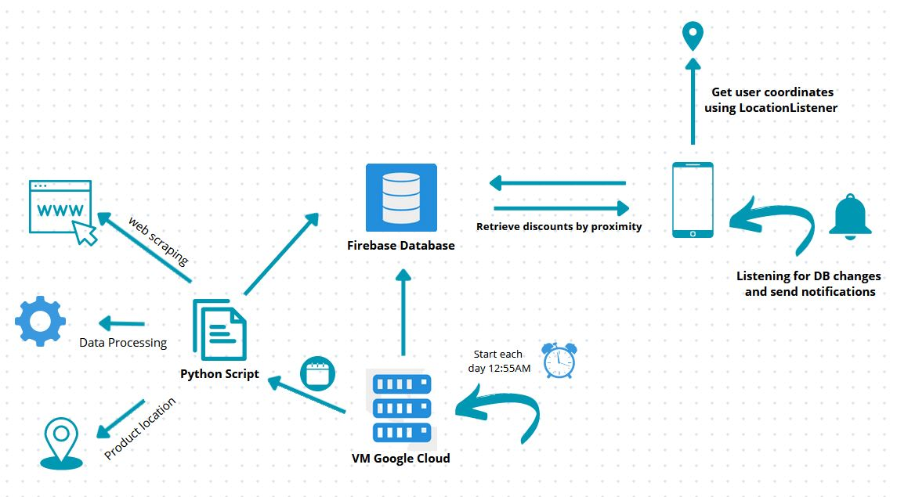
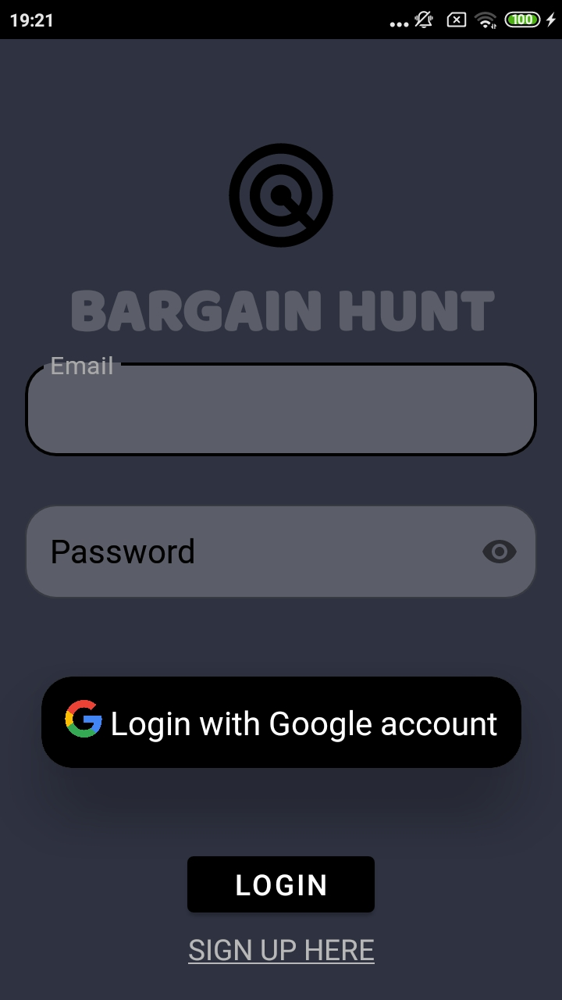
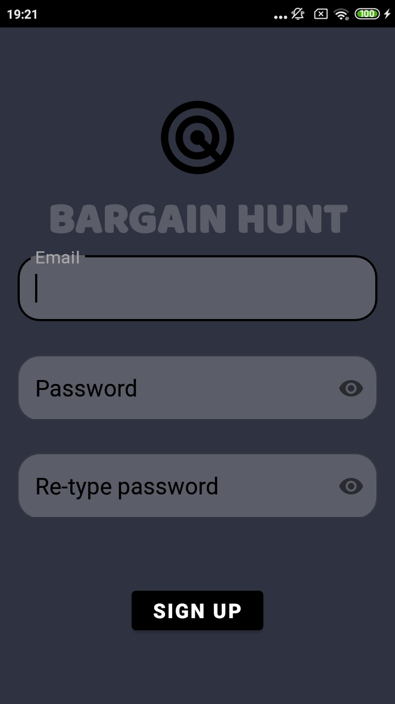
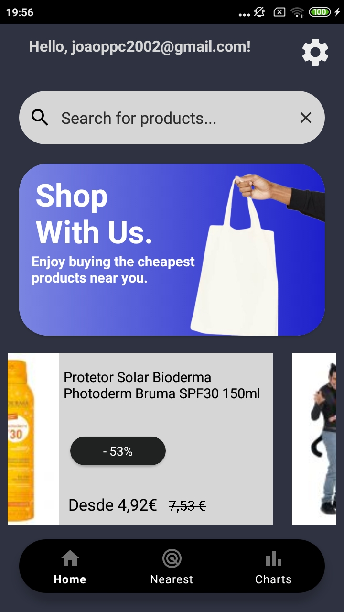
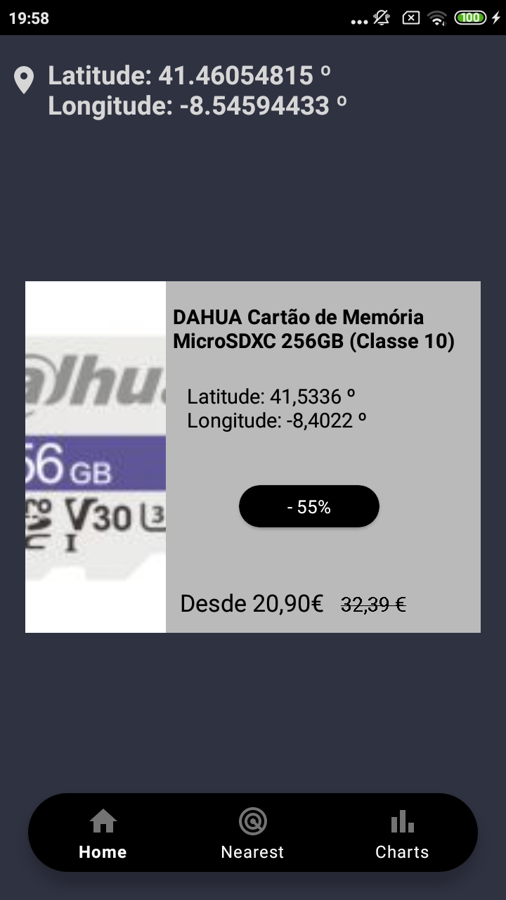
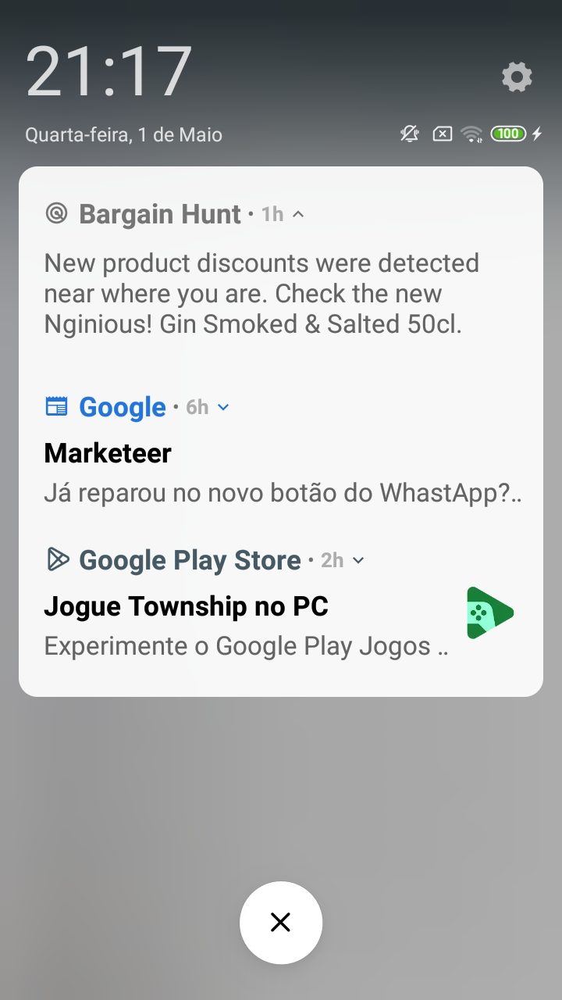
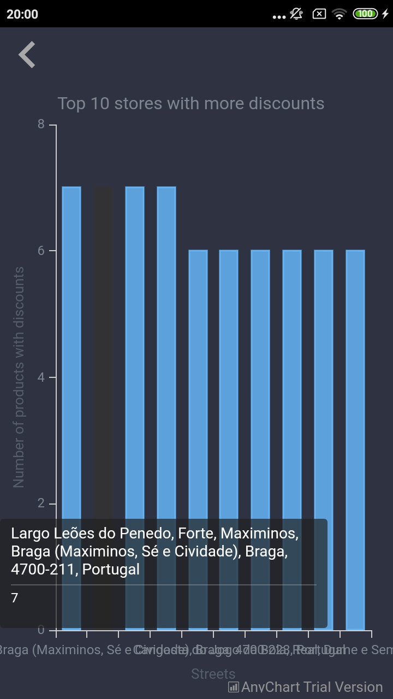
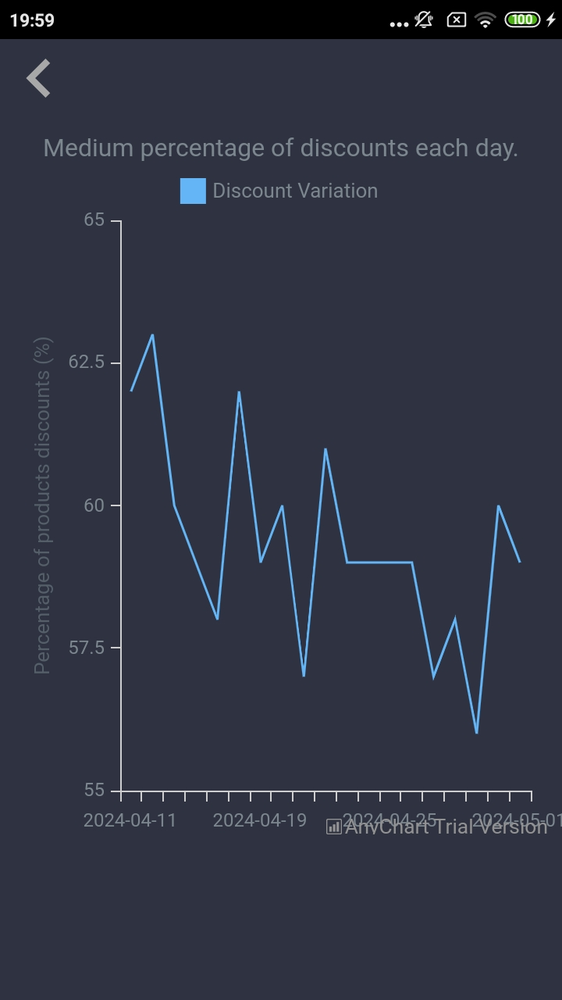

# Bargain Hunt App

Projeto de Sensorização e Ambiente
Bargain Hunt App

Equipa de desenvolvimento: 
Bernard Ambrósio Georges - PG53698  
João Paulo Peixoto Castro - PG53929

## Arquitetura

Na imagem presente encontra-se a arquitetura para a aplicação Bargain Hunt. Em baixo encontram-se os detalhes acerca dos eventos, fluxos de dados e pedidos envolvidos.

O script python, onde é feito o web scraping do website das vendas, o trata-
mento dos dados e a localização dos produtos, é armazenado numa virtual ma-
chine na Google Cloud. Como primeiro passo, associámos a esta VM uma sched-
ule para a instância iniciar às 12:55 AM e encerrar às 01:15 AM. Para a autom-
atização da execução do script utilizámos o job scheduler ’cron’ que é fornecido
em sistemas operativos UNIX, e criámos um ficheiro shell script que invoca o
script python às 1:00 AM. O tratamento de dados efetuado apenas se baseou na
criação de objetos que possuíam uma lista de dados em JSON correspondentes a
cada um dos produtos. Esse tratamento era essencial para proceder à povoação
da base de dados do Firestore.
Relativamente às interações entre a aplicação e a base de dados consistem
principalmente em executar consultas para retornar todos os produtos em de-
sconto até o momento, bem como os cinco produtos em desconto mais próximos
das coordenadas do utilizador no dia atual. Para além disso, foi adicionado um
snapshot listener, de forma a que quando existem modificações na base de da-
dos seja enviada uma notificação ao utilizador a informar que existem novos
descontos.

## Funcionalidades 

De seguida serão apresentadas algumas das funcionalidades do nosso sistema, recorrendo a algumas capturas de ecrã realizadas.

Foi integrada na aplicação um serviço de autenticação usando o Firebase Authentication. Isto irá permitir reconhecer a identidade do utilizador e impedir o acesso de indivíduos não verificados. Os métodos de autenticação implementados foram de email/senha, e através de contas Google. Nas atividades desenvolvidas foi utilizado o sdk auth do firebase para gerir o estado do utilizador. Através do método getAuth conseguímos obter o utilizador atual e reencaminhá-lo para a página principal Home, e com o método SignOut também fornecido permitir o término das sessões. Como podemos observar em (a) encontra-se a página para o utilizador fazer login na sua conta, enquanto que (b) corresponde à página para criação de uma conta. 

Em (a) encontra-se a página correspondente à listagem de todos os produtos em saldo recolhidos até ao momento. Para uma pesquisa mais eficiente de quais foram os produtos que tiveram uma redução de preço é possível efetuar uma filtragem por nome. Cada um desses card items fazem parte de um recyclerview, e assim que um dado produto é escrito, é enviado um notification ao adapter para mostrar os produtos que possuem aquele nome em específico. No que toca à ferramenta, ao clicar nesta o utilizador é redirecionado para a página de definições onde pode terminar a sessão. Na parte inferior da tela existe um NavigationBar, onde se encontram as páginas no qual o utilizador pode realizar funcionalidades diferentes, entre essas encontram-se a Home Page, a Nearest Page, e por último a Charts Page, onde está representada uma visualização estatística dos dados recolhidos. Em (b) num primeiro momento é detetada a geolocalização do utilizador. Para isso foi criado um objeto viewmodel que irá alterar os valores do objeto LocationData que possui um atributo de latitude e outro de longitude. No método onchanged na classe que implementa o locationsensor irá ser modificado o LocationData do viewmodel. Esses valores são disponibilizados no ecrã e é feita uma query à DB onde iremos filtrar os produtos que estão mais próximos dessas coordenadas (no ecrã são disponibilizados os 5 produtos mais próximos incluindo a sua localização).

Para cada um dos cardviews é possível obter informações específicas relativas aos produtos em questão, como o nome, rua, latitude e longitude e preço. Para além disso, existe um botão de encomendar o produto, que poderia constituir numa fonte de rendimento extra. Esse plano poderia passar por chegar a um acordo em que uma percentagem da venda de até 5% reverteria para nós, ainda que os custos relativos à distribuição ficariam ao encargo dessas lojas. Em (b) podemos visualizar uma notificação de um novo produto que está em saldos. Para isso utilizou-se um snapshot listener dos dados para a coleção do dia atual, em que caso seja detetada alguma adição é iniciado o nosso serviço de notificações (MyNotificationService), onde personalizámos a notificação avisando o utilizador acerca de um novo produto que tenha sido detetado.
%apresentar a aplicação mobile Bargain Hunt, listar algumas das suas funcionalidades, arquitetura, alguns screenshots

### Visualização
Relativamente à parte da visualização dos resultados obtidos foram implementados dois gráficos, nomeadamente, um bar chart e um line graph. O gráfico de barras revela as top 10 ruas onde é possível encontrar um maior número de produtos em saldo. Ou seja, cada uma das ruas terá como frequência o número de produtos desde o início da recolha. Já no gráfico de linhas é possível visualizar a variação média dos descontos a cada dia.

Nesta secção foi usada uma biblioteca de visualização de dados, AnyChart Android Charts. Esta biblioteca corre para Android 4.4 e superior (API 19>=).

